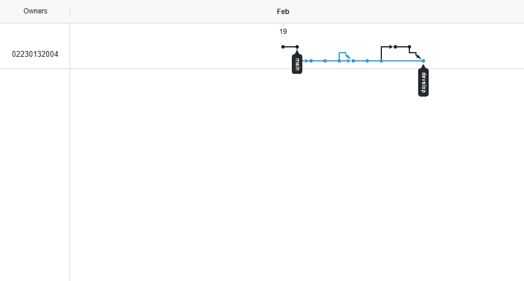

# U1_Post2 - Flujo GitFlow para Proyecto Móvil  
**Universidad de Santander (UDES)**  
**Unidad 1: Ecosistema Móvil y Fundamentos Avanzados**  
**Post-Contenido 2 — Proyecto: Flujo Git para Equipo de Desarrollo Móvil**


## Objetivo del proyecto
Implementar un flujo de trabajo Git profesional (GitFlow) en un repositorio de proyecto móvil, aplicando convenciones de commits (**Conventional Commits**), creando ramas **feature/**, **release/** y **hotfix/**, y simulando un ciclo de release completo.

**Nota**: Esta actividad se realizó de forma **individual** (aunque el documento menciona equipo de 2-3 personas), simulando el flujo completo con múltiples ramas y merges.

## Desarrollador
- **Miguel Rizo** (Código: 02230132004)  
- Trabajo individual – Trabajo solo en todas las ramas y merges.

## Tecnologías / Estructura
- Simulación de proyecto Android (carpetas app/src/main/java, res/layout, etc.)
- GitFlow: main (estable), develop (integración), feature/*, release/*, hotfix/*
- Conventional Commits: feat, fix, docs, chore, ci, style
- GitHub Actions (CI básico en .github/workflows/build.yml)

## Estructura de ramas utilizada (GitFlow)
- **main**: versión estable con tags v1.0.0 y v1.0.1
- **develop**: integración de todas las features y hotfix
- **feature/estructura-proyecto**: estructura base Android
- **feature/documentacion**: CONTRIBUTING.md y README actualizado
- **feature/ci-setup**: workflow CI básico
- **release/1.0.0**: preparación de versión inicial + CHANGELOG
- **hotfix/1.0.1**: corrección de typo o ejemplo en documentación

Todos los merges se realizaron con **Create a merge commit** (equivalente a --no-ff).




## Convenciones utilizadas
- **Conventional Commits**: todos los mensajes siguen el formato `<type>(scope): <descripción>`  
  Ejemplos:
  - feat(app): crear estructura inicial del proyecto Android
  - docs(readme): actualizar con guía de convenciones y flujo GitFlow
  - ci(github): agregar workflow básico de CI para Android
  - chore(release): preparar versión 1.0.0
  - fix(docs): corregir typo en README.md

- Mínimo 10 commits cumplidos (ver historial).

## Instrucciones para clonar y explorar
```bash
# Clonar el repositorio
git clone https://github.com/tuusuario/U1_Post2_02230132004_Rizo_Miguel.git

# Entrar al repositorio
cd U1_Post2_02230132004_Rizo_Miguel

# Cambiar a rama develop (integración)
git checkout develop

# Ver el historial gráfico de ramas
git log --oneline --graph --all --decorate

# Ver tags de versiones
git tag -l

FIX (hotfix 1.0.1): corregido error tipográfico en la línea "clon" → ahora dice "clone".
